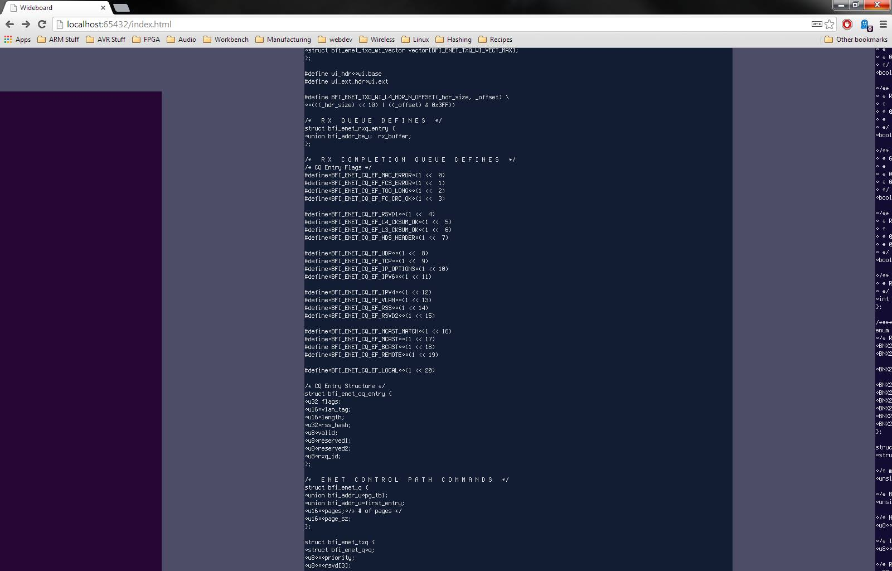

Wideboard
=========

This repo is an old proof of concept for "how much text can you render in a web browser at once?", for which the answer is "At least the entire Linux kernel, or as much text as will fit in your GPU's ram".

Wideboard uses vanilla WebGL 1, some special shaders, and some GPU-compatible data structures to render arbitrarily large amounts of monospace, unformatted text in a web browser - you can zoom in and out on each file ala Google Maps, and it should render at 60 frames per second on even a weak integrated GPU.

The codebase is old, unmaintained, and uses Google's Closure Compiler for the frontend and an old version of Node as the backend - getting it working again, porting it to Typescript, and adding a more modern backend would be an interesting project.

